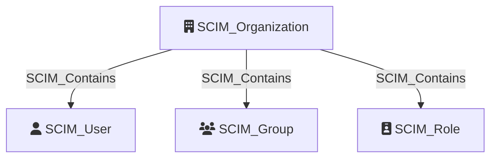

# SCIM_Organization

Represents a synchronized organization or tenant in the identity provider (IdP). An application may synchronize users and groups from multiple organizations or tenants via SCIM. The `SCIM_Organization` node serves as the root container for all SCIM resources belonging to a given tenant, providing a clear boundary for identity governance and access control.

## Properties

| Property | Type | Description | Sample Value |
| --- | --- | --- | --- |
| `id` | `string` | The unique identifier of the organization or tenant. | `contoso.com` |
| `displayName` | `string` | The display name of the organization or tenant. | `Contoso` |
| `url` | `string (uri)` | The URL of the organization or tenant in the IdP. | `https://contoso.com/scim` |

## Diagram

