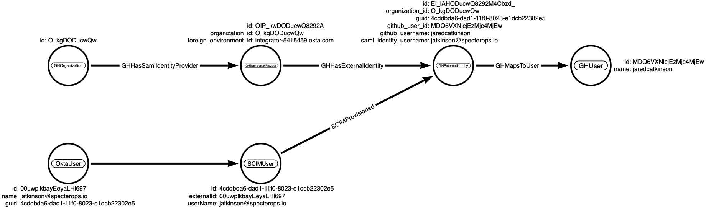
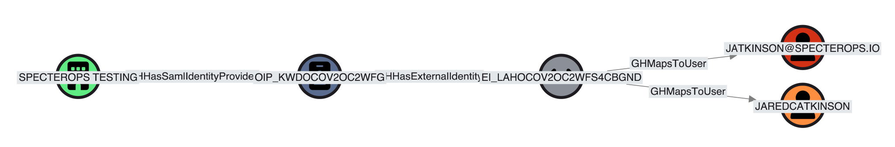

# DRAFT: BloodHound SCIM Schema Extension

**[System for Cross-domain Identity Management (SCIM)](https://scim.cloud/) schema extension for BloodHound**

[](#)

## Overview

The SCIM protocol is used by various cloud identity providers (IdPs), such as Okta or Entra ID,
to provision user accounts and groups to/from applications.
This schema extension allows BloodHound to represent SCIM-provisioned users and groups as nodes in the graph,
avoiding the need to introduce technology-specific edges for each integration, such as Okta+GitHub, Entra+GitHub, or Entra+SalesForce.

## Nodes

The SCIM data model is relatively simple, consisting of two main resource types: `User` and `Group`:


These resources have a [well-defined schema](https://scim.cloud/specs/draft-scim-core-schema-00.html).
In BloodHound, we represent them as the following node types:

| Icon | Node Type | Description |
| --- | --- | --- |
|  | [SCIM_User](#scim_user-node) | A user account provisioned via SCIM |
|  | [SCIM_Group](#scim_group-node) | A group provisioned via SCIM |
|    | [SCIM_Role](#scim_role-node) | A role assigned to users |
|  | [SCIM_Organization](#scim_organization-node) | An organization or tenant in the IdP |

> [!NOTE]
> To keep the schema simple, we do not create separate node types for `User` and `EnterpriseUser` in OpenGraph,
> as defined in the SCIM specification.
> On the other hand, we do create a separate `SCIM_Role` node type to represent the `roles` attribute of users.
> Similarly, we create a `SCIM_Organization` node type to represent each synchronized organization or tenant.

### SCIM_User Node

The `SCIM_User` node represents a user resource in SCIM.

| Property | SCIM Property | Type | Description | Sample Value |
| --- | --- | --- | --- | --- |
| `id` | `id` | `string` | Unique identifier for the SCIM resource as defined by the Service Provider; stable and non-reassignable. | `2819c223-7f76-453a-919d-413861904646` |
| `externalId` | `externalId` | `string` | Identifier defined by the SCIM client for cross-system correlation. | `dschrute` |
| `userName` | `userName` | `string` | Unique user identifier used for authentication or display; required. | `dschrute` |
| `enabled` | `active` | `boolean` | Whether the user account is active. | `true` |
| `displayName` | `displayName` / `name.formatted` | `string` | Display name for the user. | `Dwight Schrute` |
| `givenName` | `name.givenName` | `string` | Given (first) name. | `Dwight` |
| `familyName` | `name.familyName` | `string` | Family (last) name. | `Schrute` |
| `middleName` | `name.middleName` | `string` | Middle name(s). | `Kurt` |
| `honorificPrefix` | `name.honorificPrefix` | `string` | Honorific prefix (title). | `Mr.` |
| `honorificSuffix` | `name.honorificSuffix` | `string` | Honorific suffix. | `Jr.` |
| `title` | `title` | `string` | Job title. | `Assistant to the Regional Manager` |
| `userType` | `userType` | `string` | Organization-to-user relationship type. | `Employee` |
| `profileUrl` | `profileUrl` | `string (uri)` | URL to the user's profile page. | `https://example.com/dschrute` |
| `mail` | `emails.primary` | `string` | Primary email address from `emails` where `primary=true`. | `dschrute@example.com` |
| `otherMails` | `emails` | `string[]` | Secondary email addresses from other `emails` entries. | `["dschrute@contoso.com"]` |
| `role` | `roles` | `string[]` | Role names from the user's `roles` attribute. | `["Sales", "Management"]` |
| `employeeNumber` | `employeeNumber` | `string` | Enterprise user employee number. | `12345` |
| `organization` | `organization` | `string` | Enterprise user organization name. | `Contoso` |
| `department` | `department` | `string` | Enterprise user department name. | `Sales` |
| `managerId` | `manager.managerId` | `string` | Identifier of the user's manager. | `2819c223-7f76-453a-919d-413861904646` |
| `created` | `meta.created` | `datetime` | Resource creation timestamp. | `2010-01-23T04:56:22Z` |
| `lastModified` | `meta.lastModified` | `datetime` | Resource last modified timestamp. | `2011-05-13T04:42:34Z` |

> [!NOTE]
> Most attributes use 1:1 mapping, but some, such as `mail` and `otherMails`,
> are transformed from multi-valued SCIM attributes like `emails`.

> [!IMPORTANT]
> TODO: Map the BH `name` property.
> TODO: Assure `id` and `externalId` uniqueness.

### SCIM_Group Node

The `SCIM_Group` node represents a group resource in SCIM.

| Property | SCIM Property | Type | Description | Sample Value |
| --- | --- | --- | --- | --- |
| `id` | `id`  | `string` | The unique identifier of the group | `2819c223-7f76-453a-919d-413861904646` |
| `displayName` | `displayName` | `string` | The display name of the group | `Sales Team` |
| `created` | `meta.created` | `datetime` | The date and time the group was created | `2010-01-23T04:56:22Z` |
| `lastModified` | `meta.lastModified` | `datetime` | The date and time the group was last modified | `2011-05-13T04:42:34Z` |

### SCIM_Role Node

In SCIM, roles are typically represented as a multi-valued string attribute of users.
To represent them as nodes in the graph, we create `SCIM_Role` nodes instead.

| Property | SCIM Property | Description | Sample Value |
| --- | --- | --- | --- |
| `id` | `User.roles` | The unique identifier of the role | `8de4e0ea7370e4e60a521379c9edf3253afcba7660e647f3aa788e49e8993d1a` |
| `name` | `User.roles` | The name of the role | `Sales` |

> [!NOTE]
> We need to assign a unique ID to each role to represent them as nodes in the graph.
> The proposed ID format is a SHA256 hash of the organization identifier and the role name,
> e.g. `SHA256("SCIM_Role:contoso.com:Sales")`.

### SCIM_Organization Node

To represent each synchronized organization or tenant in the IdP, we create `SCIM_Organization` nodes.
An application may synchronize multiple organizations or tenants.

| Property | Description | Sample Value |
| --- | --- | --- |
| `id` | The unique identifier of the organization or tenant | `contoso.com` |
| `displayName` | The display name of the organization or tenant | `Contoso` |
| `url` | The URL of the organization or tenant in the IdP | `https://contoso.com/scim` |

> [!IMPORTANT]
> TODO: Map the BH `name` property.
> TODO: Assure `id` uniqueness.
> TODO: Improve `id` and `name` mapping.

## Edges

### SCIM_Contains

The `SCIM_Contains` edge represents the containment relationship between an organization and its SCIM resources.

```cypher
(:SCIM_Organization)-[:SCIM_Contains]->(:SCIM_User)
(:SCIM_Organization)-[:SCIM_Contains]->(:SCIM_Group)
(:SCIM_Organization)-[:SCIM_Contains]->(:SCIM_Role)
```

### SCIM_MemberOf

The `SCIM_MemberOf` edge represents group membership relationships between users and groups,
as well as nested group relationships, as defined by the `members` attribute of groups
and the `groups` attribute of users in the SCIM schema.

```cypher
(:SCIM_User)-[:SCIM_MemberOf]->(:SCIM_Group)
(:SCIM_Group)-[:SCIM_MemberOf]->(:SCIM_Group)
```

### SCIM_HasRole

The `SCIM_HasRole` edge represents the relationship between users and their assigned roles,
as defined by the `roles` attribute in the SCIM user schema.

```cypher
(:SCIM_User)-[:SCIM_HasRole]->(:SCIM_Role)
```

### SCIM_ManagerOf

The `SCIM_ManagerOf` edge represents the managerial relationship between users,
as defined by the `manager` attribute in the SCIM user schema.

```cypher
(:SCIM_User)-[:SCIM_ManagerOf]->(:SCIM_User)
```

## Hybrid Edges

In addition to the core SCIM edges, we can also create hybrid edges that connect SCIM nodes to other nodes in the graph,
such as AD users and groups, to represent relationships between on-premises and cloud identities.

### SCIM_Provisioned

```cypher
(:SCIM_User)-[:SCIM_Provisioned]->(:GH_ExternalIdentity)
(:SCIM_Group)-[:SCIM_Provisioned]->(:GH_Group)
```

> [!IMPORTANT]
> TODO: Work in progress. Create inbound and outbound sync edges.



