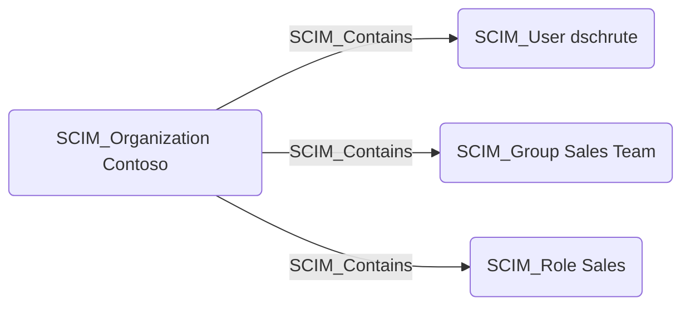

# SCIM_Contains

## Edge Schema

- Source: [SCIM_Organization](../node-descriptions/SCIM_Organization.md)
- Destination: [SCIM_User](../node-descriptions/SCIM_User.md), [SCIM_Group](../node-descriptions/SCIM_Group.md), [SCIM_Role](../node-descriptions/SCIM_Role.md)

## General Information

The [SCIM_Contains](SCIM_Contains.md) edge represents the containment relationship between an organization and its SCIM resources. Each SCIM user, group, and role belongs to exactly one organization, establishing a clear ownership boundary. This edge is significant for scoping identity governance — all resources contained by an organization are managed by that organization's identity provider.

