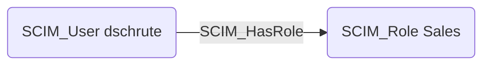

# SCIM_HasRole

## Edge Schema

- Source: [SCIM_User](../node-descriptions/SCIM_User.md)
- Destination: [SCIM_Role](../node-descriptions/SCIM_Role.md)

## General Information

The [SCIM_HasRole](SCIM_HasRole.md) edge represents the relationship between users and their assigned roles, as defined by the `roles` attribute in the SCIM user schema. Roles are extracted from user attributes and represented as separate nodes to enable graph-based analysis of role assignments across the organization. This edge allows identifying all users who share a particular role.

