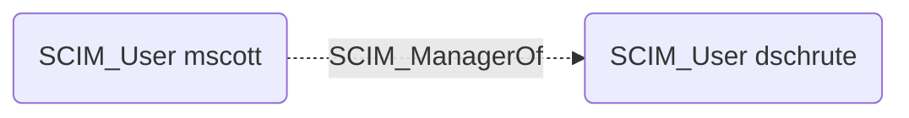

# SCIM_ManagerOf

## Edge Schema

- Source: [SCIM_User](../node-descriptions/SCIM_User.md)
- Destination: [SCIM_User](../node-descriptions/SCIM_User.md)

## General Information

The [SCIM_ManagerOf](SCIM_ManagerOf.md) edge represents the managerial relationship between users, as defined by the `manager` attribute in the SCIM Enterprise User schema extension. This edge captures the organizational hierarchy, connecting a manager to their direct reports. Manager relationships can be significant for understanding organizational structure and potential privilege escalation paths through social engineering or delegated approval workflows.

