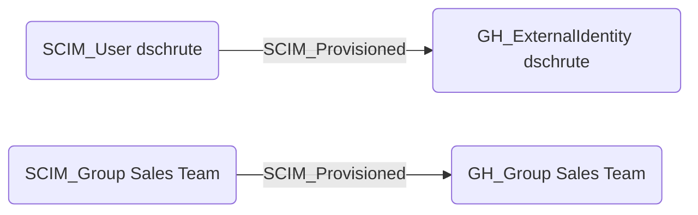

# SCIM_Provisioned

## Edge Schema

- Source: [SCIM_User](../node-descriptions/SCIM_User.md), [SCIM_Group](../node-descriptions/SCIM_Group.md)
- Destination: [GH_ExternalIdentity](https://bloodhound.specterops.io/opengraph/extensions/githound/reference/nodes/gh_externalidentity), [GH_Group](https://bloodhound.specterops.io/opengraph/extensions/githound/reference/nodes/gh_group)

## General Information

The [SCIM_Provisioned](SCIM_Provisioned.md) edge represents the hybrid relationship between SCIM resources and their provisioned counterparts in downstream applications, such as GitHub. When an identity provider provisions a user or group via SCIM, this edge connects the SCIM source identity to the resulting application-specific identity. These edges are critical for tracing cross-domain access paths from cloud IdP identities to application-level permissions.

